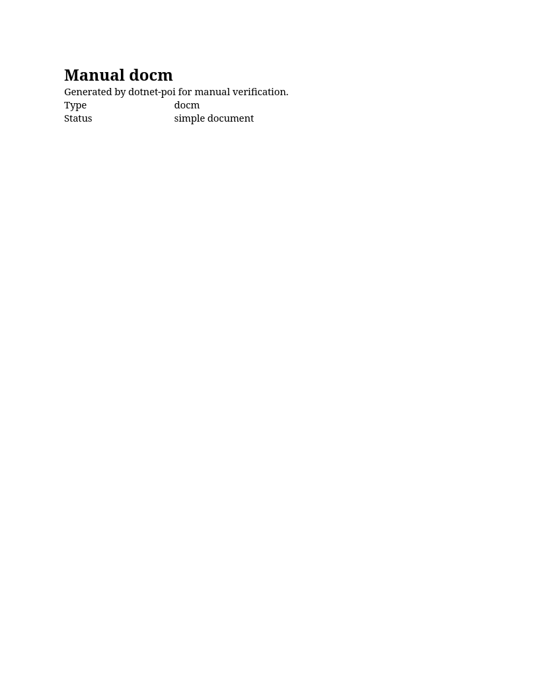
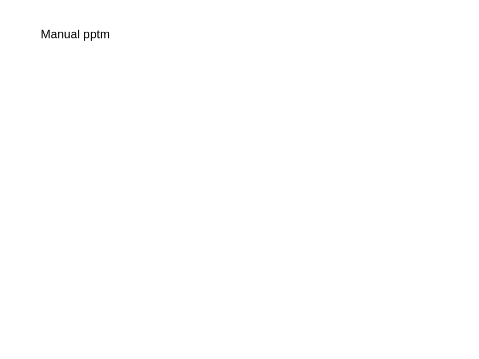
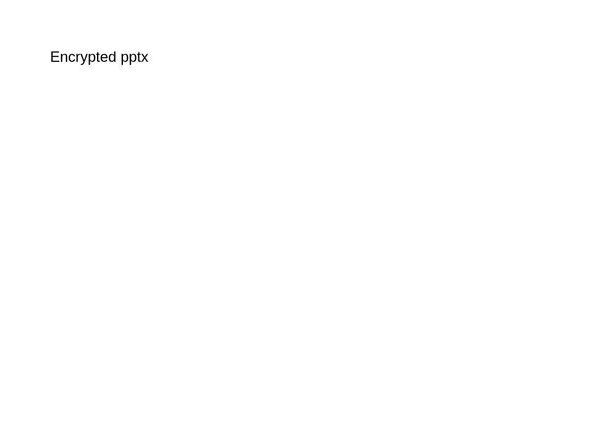

# DotnetPOI v0.1.0-f82672e Linux LibreOffice Evidence

- Project version: `0.1.0`
- Git revision: `f82672e`
- Captured: `2026-05-06 23:04:51 +0900` - `2026-05-06 23:04:55 +0900`
- Environment: Docker service `libreoffice`, container `dotnet-poi-phase11-libreoffice`
- LibreOffice: `LibreOffice 25.8.1.1 580(Build:1)`
- Source root: `tools/manual-verification/generated-documents`
- Overall: `PASS`
- Result counts: `9` pass, `0` missing fixture, `0` fail

This evidence pass opens each available file through LibreOffice UNO, rejects failures/exceptions as a failed case, reopens the work copy, exports a PNG preview, and writes this index for GitHub review.

## Matrix

| kind | source | encrypted | open | reopen | status | evidence | notes |
|---|---|---:|---:|---:|---:|---|---|
| xlsx | tools/manual-verification/generated-documents/manual-simple.xlsx | no | PASS | PASS | PASS |  |  |
| xlsm | tools/manual-verification/generated-documents/manual-simple.xlsm | no | PASS | PASS | PASS |  |  |
| encrypted xlsx | tools/manual-verification/generated-documents/manual-encrypted.xlsx | yes | PASS | PASS | PASS |  |  |
| docx | tools/manual-verification/generated-documents/manual-simple.docx | no | PASS | PASS | PASS |  |  |
| docm | tools/manual-verification/generated-documents/manual-simple.docm | no | PASS | PASS | PASS |  |  |
| encrypted docx | tools/manual-verification/generated-documents/manual-encrypted.docx | yes | PASS | PASS | PASS |  |  |
| pptx | tools/manual-verification/generated-documents/manual-simple.pptx | no | PASS | PASS | PASS |  |  |
| pptm | tools/manual-verification/generated-documents/manual-simple.pptm | no | PASS | PASS | PASS |  |  |
| encrypted pptx | tools/manual-verification/generated-documents/manual-encrypted.pptx | yes | PASS | PASS | PASS |  |  |

## Notes

- `MISSING` means generated manual documents are not present; run `dotnet run --project tools/manual-verification/DocumentGenerator/DocumentGenerator.csproj`.
- The original files are not modified; work copies are written under `workfiles/`.
- PNG previews are exported by LibreOffice itself, not by the browser screenshot path.
- Password for generated encrypted files: `f`.
