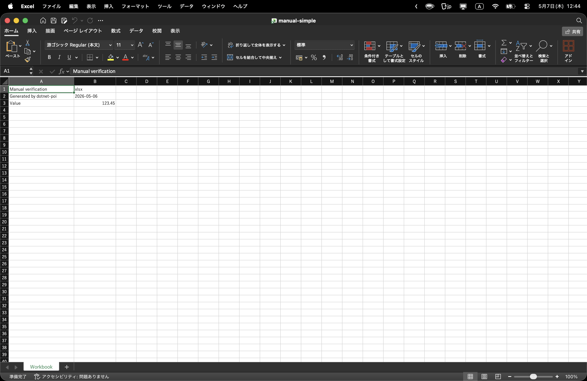
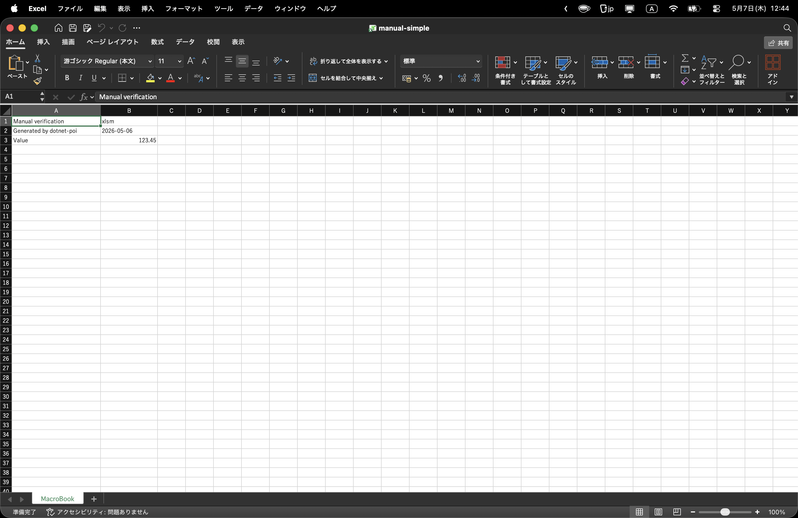
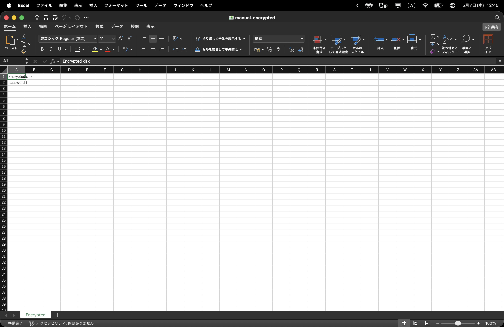
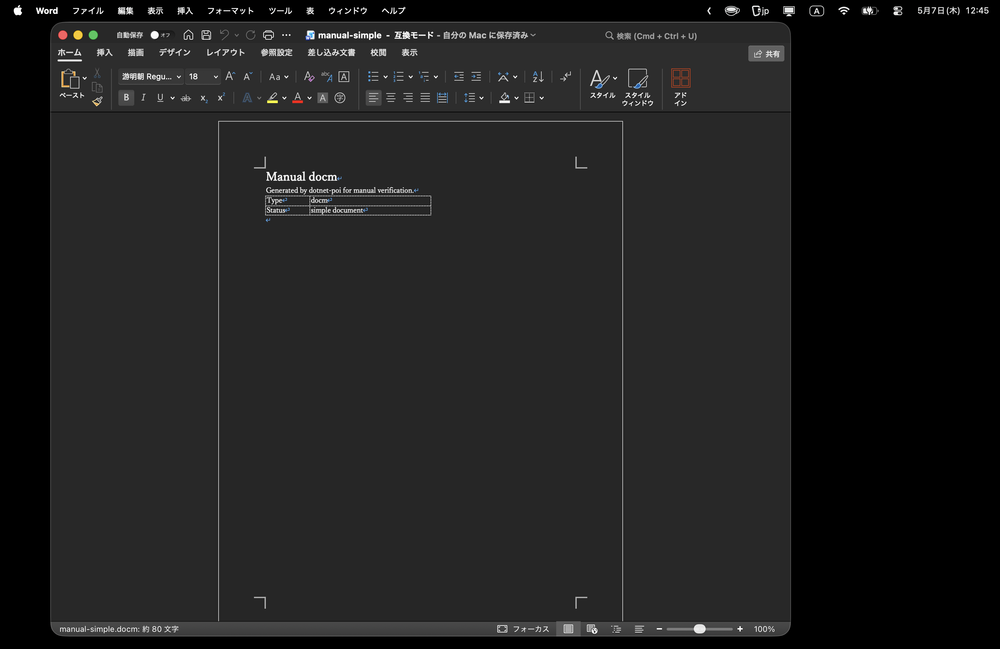
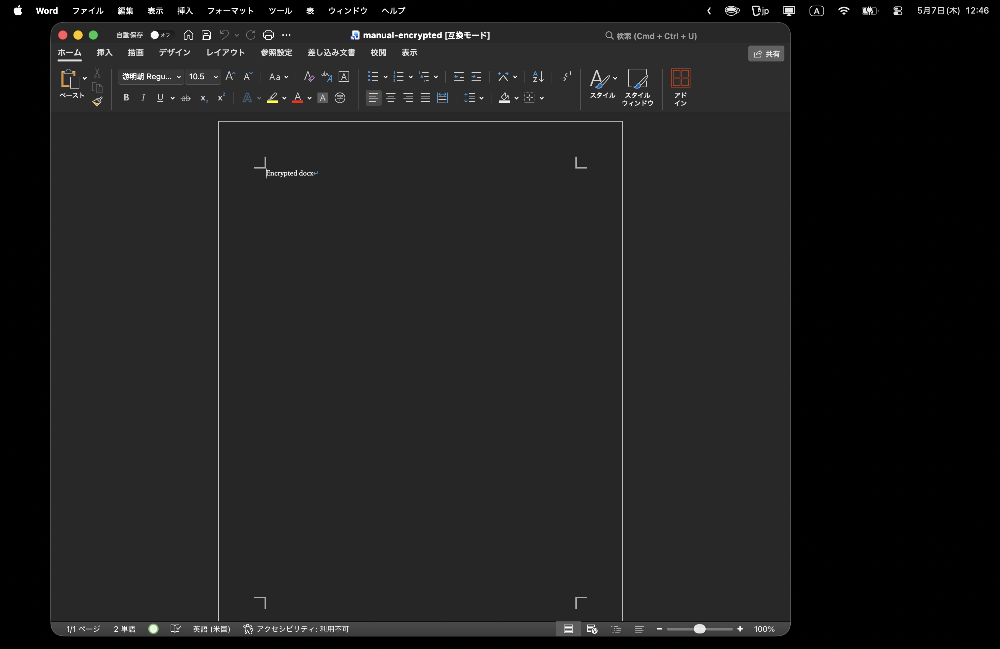
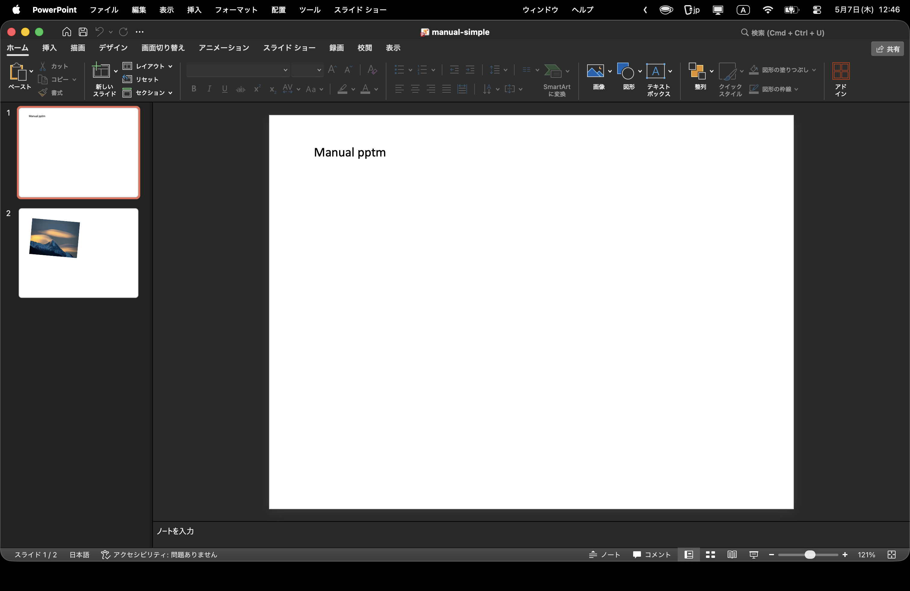
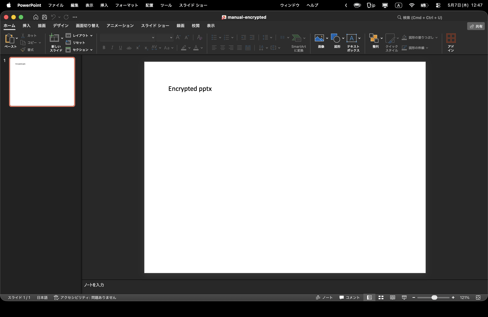

# DotnetPOI v0.5.0-f764644-macos macOS Office Evidence

- Project version: `0.5.0`
- Git revision: `f764644`
- Captured: `2026-05-07 12:44:15 +0900` - `2026-05-07 12:47:27 +0900`
- Environment: macOS Microsoft Office apps
- Excel: `16.108.3`
- Word: `16.108.3`
- PowerPoint: `16.108.3`
- Source root: `tools/manual-verification/generated-documents`
- Overall: `PASS`
- Result counts: `9` pass, `0` missing fixture, `0` permission required, `0` fail

This evidence pass opens each available file in the corresponding macOS Microsoft Office app, treats open/reopen failures as failed cases, captures a screen PNG, and writes this index for GitHub review.

## Matrix

| kind | app | source | encrypted | open | reopen | status | evidence | notes |
|---|---|---|---:|---:|---:|---:|---|---|
| xlsx | excel | tools/manual-verification/generated-documents/manual-simple.xlsx | no | PASS | PASS | PASS |  |  |
| xlsm | excel | tools/manual-verification/generated-documents/manual-simple.xlsm | no | PASS | PASS | PASS |  |  |
| encrypted xlsx | excel | tools/manual-verification/generated-documents/manual-encrypted.xlsx | yes | PASS | PASS | PASS |  |  |
| docx | word | tools/manual-verification/generated-documents/manual-simple.docx | no | PASS | PASS | PASS |  |  |
| docm | word | tools/manual-verification/generated-documents/manual-simple.docm | no | PASS | PASS | PASS |  |  |
| encrypted docx | word | tools/manual-verification/generated-documents/manual-encrypted.docx | yes | PASS | PASS | PASS |  |  |
| pptx | powerpoint | tools/manual-verification/generated-documents/manual-simple.pptx | no | PASS | PASS | PASS |  |  |
| pptm | powerpoint | tools/manual-verification/generated-documents/manual-simple.pptm | no | PASS | PASS | PASS |  |  |
| encrypted pptx | powerpoint | tools/manual-verification/generated-documents/manual-encrypted.pptx | yes | PASS | PASS | PASS |  |  |

## Notes

- `MISSING` means generated manual documents are not present; run `dotnet run --project tools/manual-verification/DocumentGenerator/DocumentGenerator.csproj`.
- The original files are not modified; work copies are written under `workfiles/`.
- Password for generated encrypted files: `f`.
- Screenshots are captured with macOS `screencapture`; run permission/bootstrap mode first if preflight reports `PERMISSION_REQUIRED`.
