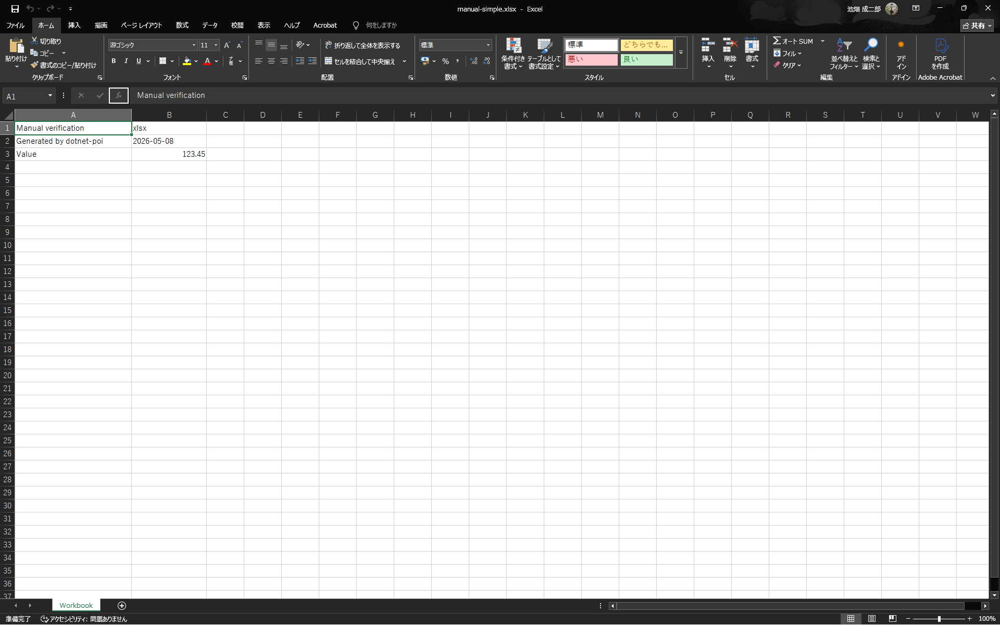
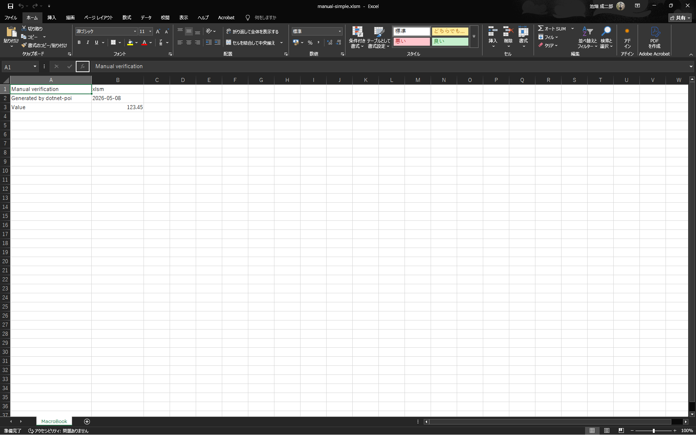
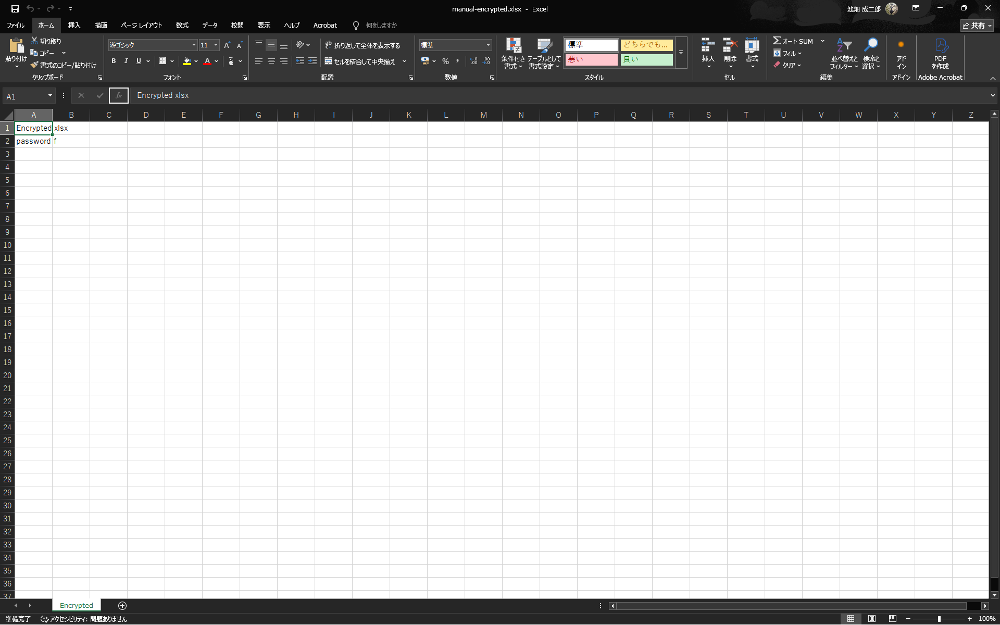
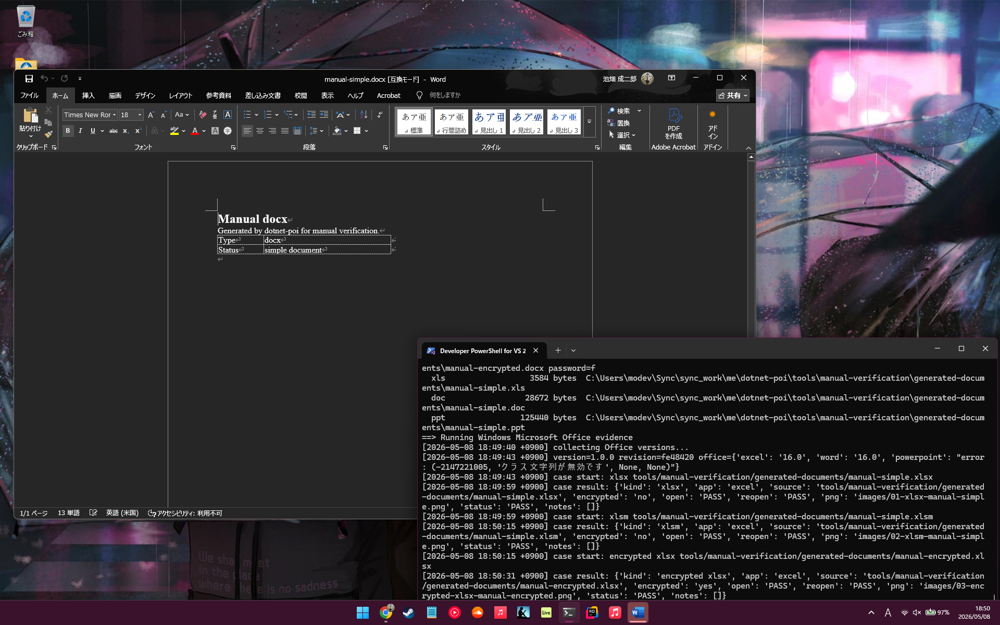
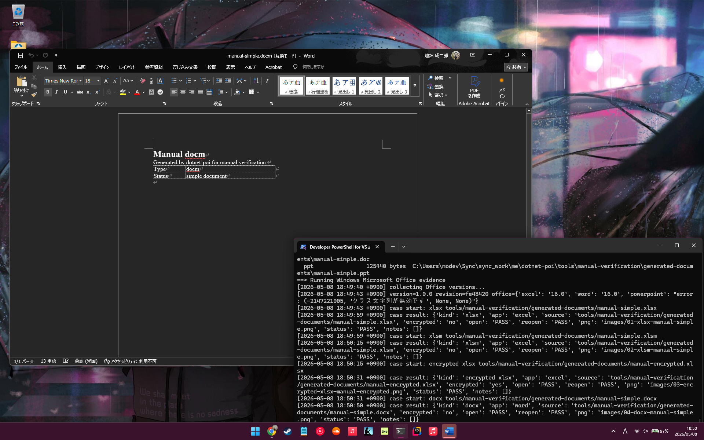
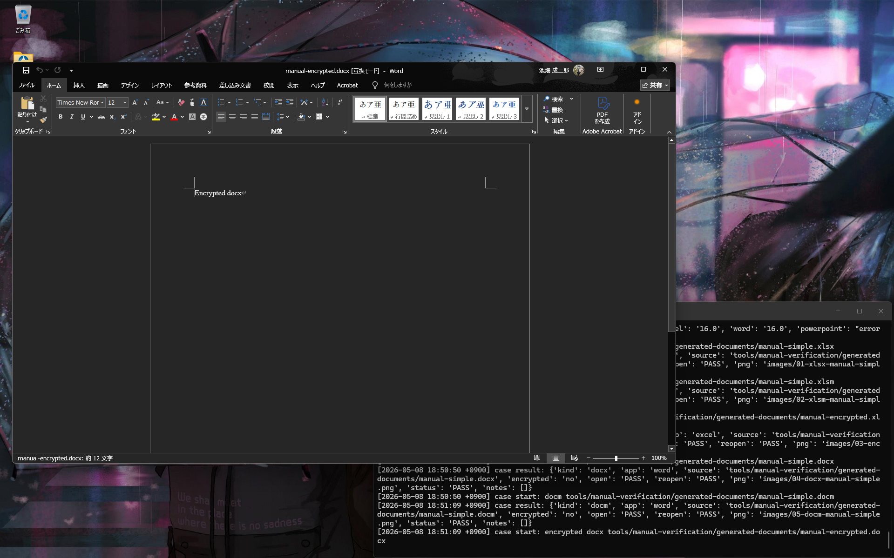
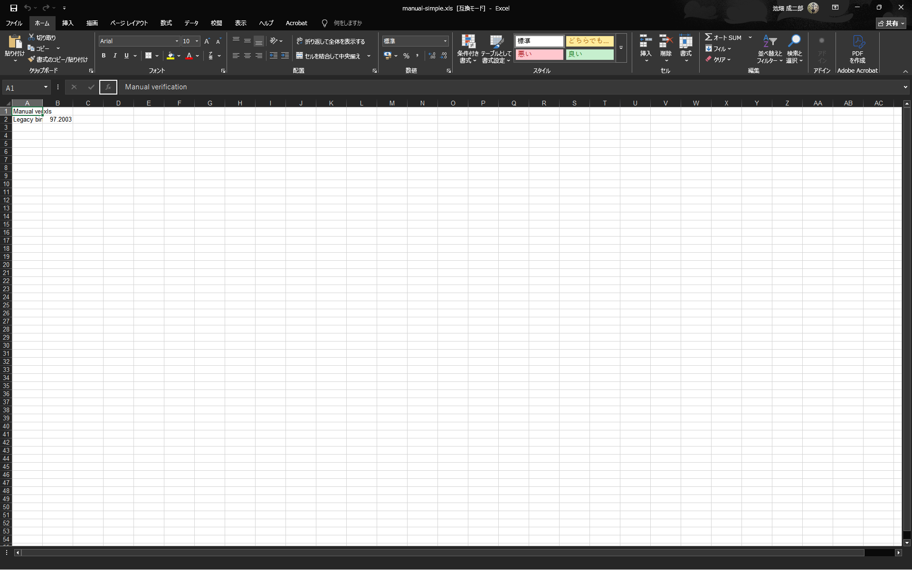

# DotnetPOI v1.0.0-fe48420-windows Windows Office Evidence

- Project version: `1.0.0`
- Git revision: `fe48420`
- Captured: `2026-05-08 18:49:40 +0900` - `2026-05-08 18:52:38 +0900`
- Environment: Windows Microsoft Office (COM automation)
- Excel: `16.0`
- Word: `16.0`
- PowerPoint: `error: (-2147221005, 'クラス文字列が無効です', None, None)`
- Source root: `tools/manual-verification/generated-documents`
- Overall: `PASS`
- Result counts: `8` pass, `0` missing fixture, `0` fail

Macro security: `AutomationSecurity = msoAutomationSecurityLow (1)` is applied on each COM
application before opening files. Macro prompts are suppressed by design for this compatibility
verification; the goal is to confirm files open without repair dialogs, not to test macro execution.

## Matrix

| kind | app | source | encrypted | open | reopen | status | evidence | notes |
|---|---|---|---:|---:|---:|---:|---|---|
| xlsx | excel | tools/manual-verification/generated-documents/manual-simple.xlsx | no | PASS | PASS | PASS |  |  |
| xlsm | excel | tools/manual-verification/generated-documents/manual-simple.xlsm | no | PASS | PASS | PASS |  |  |
| encrypted xlsx | excel | tools/manual-verification/generated-documents/manual-encrypted.xlsx | yes | PASS | PASS | PASS |  |  |
| docx | word | tools/manual-verification/generated-documents/manual-simple.docx | no | PASS | PASS | PASS |  |  |
| docm | word | tools/manual-verification/generated-documents/manual-simple.docm | no | PASS | PASS | PASS |  |  |
| encrypted docx | word | tools/manual-verification/generated-documents/manual-encrypted.docx | yes | PASS | PASS | PASS |  |  |
| xls | excel | tools/manual-verification/generated-documents/manual-simple.xls | no | PASS | PASS | PASS |  |  |
| doc | word | tools/manual-verification/generated-documents/manual-simple.doc | no | PASS | PASS | PASS |  |  |

## Notes

- `MISSING` means generated manual documents are not present; run `dotnet run --project tools/manual-verification/DocumentGenerator/DocumentGenerator.csproj`.
- Original files are not modified; work copies are written under `workfiles/`.
- Password for generated encrypted files: `f`.
- Screenshots captured with `PIL.ImageGrab.grab()` (full-screen). Requires `pip install Pillow`.
- COM automation requires Microsoft Office to be installed and licensed on the host machine.
- `DispatchEx` is used per case to ensure a fresh process rather than attaching to an existing instance.
